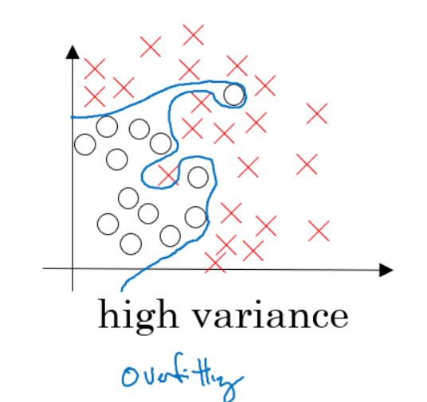
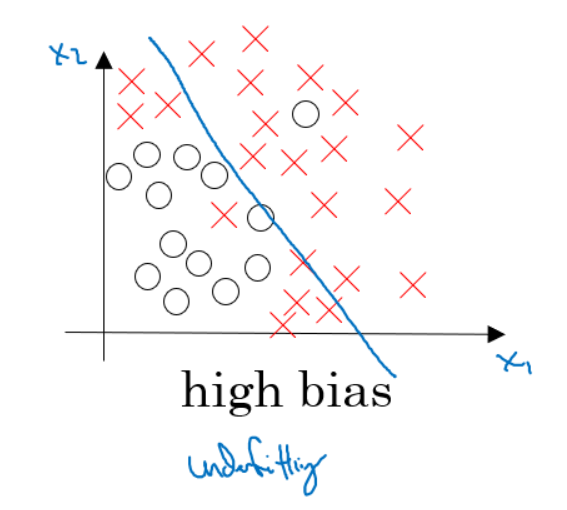
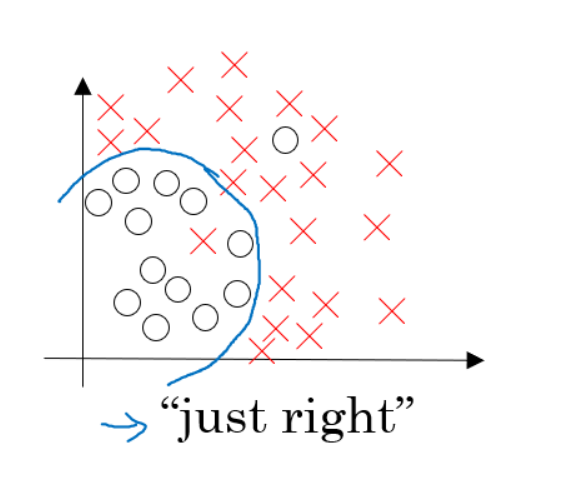

## Overfitting, Underfitting, and bias-variance trade-off:

* Arguably, Machine Learning models have one sole purpose; to generalize well
* **Generalization is the model’s ability to give sensible outputs to sets of input that it has never seen before.**
* Normal programs cannot do such a thing, as they can only give outputs “robotically” to the inputs they know.
* Performance of the model as well as the application as a whole relies heavily on the generalization of the model.
* **If the model generalizes well, it serves its purpose.**
* Overfitting and underfitting refer to deficiencies that the model’s performance might suffer from.
* Finaqlly - "A model that generalizes well is a model that is neither underfit nor overfit."

### Example
* Linear Regression allows us to map numeric inputs to numeric outputs, fitting a line into the data points. 
* This line-fitting process is the medium of both overfitting and underfitting.
* The goal of a Linear Regression is to minimize the cost.

### Overfitting:
* In a Linear Regression When we run our training algorithm on the data set, we allow the overall cost (i.e. distance from each point to the line) to become smaller with more iterations. Leaving this training algorithm run for long leads to minimal overall cost. However, this means that the line will be fit into all the points (including noise), catching secondary patterns that may not be needed for the generalizability of the model.

#### Overfitting is the case where the overall cost is really small, but the generalization of the model is unreliable. This is due to the model learning “too much” from the training data set.

* We always want to find the trend, not fit the line to all the data points. 
* Overfitting (or high variance) leads to more bad than good.
* Above mentioned model that has learned very well from the training data but still can’t make reliable predictions for new inputs.

### Underfitting:

* We want the model to learn from the training data, but we don’t want it to learn too much (i.e. too many patterns). 
* One solution could be to stop the training earlier. 
* However, this could lead the model to not learn enough patterns from the training data, **and possibly not even capture the dominant trend.**
* This case is called underfitting.

#### Underfitting is the case where the model has “ not learned enough” from the training data, resulting in low generalization and unreliable predictions.

* In high bias, the model might not have enough flexibility in terms of line fitting, resulting in a simplistic line that does not generalize well.

## Bias-variance trade-off
* What is the right measure? Depending on the model at hand, a performance that lies between overfitting and underfitting is more desirable. 
* This trade-off is the most integral aspect of Machine Learning model training.
* Machine Learning models fulfill their purpose when they generalize well. 
* Generalization is bound by the two undesirable outcomes — high bias and high variance.

In reality, we cannot calculate the real bias and variance error terms because we do not know the actual underlying target function. Nevertheless, as a framework, bias and variance provide the tools to understand the behavior of machine learning algorithms in the pursuit of predictive performance.
----
## Solution to Overfitting
Here are couple of options that may be addressed:
* Reduce the number of features 
   * Manually select or programaticallywhich features to keep.
   * Model selection algorithm
* Regularization 
   * Keep all the features, but reduce magnitude/values of model parameters (thetas).
   * Works well when we have a lot of features, each of which contributes a bit to predicting _y_.
Regularization works by adding regularization parameter to the cost function:

 - regularization parameter

> Note that you should not regularize the parameter .

In this case the **gradient descent** formula will look like the following:

 

# Regularization
* Regularization is a technique that reduces overfitting, which occurs when neural networks attempt to memorize training data, rather than learn from it.
* Regularization is one of the techniques that can prevent overfitting. 
* A number of different regularization techniques exist. **Most work by analyzing and potentially modifying the weights of a neural network as it trains.**

* Types of Regularization
  * L1 (Lasso) Regularization
  * L2 (Ridge) Regularization
  * Dropout Regularization
  
  
 ## L1 Regularization (L1 = lasso):
 
 * The main objective of creating a model(training data) is making sure it fits the data properly and reduce the loss.
 * Sometimes the model that is trained which will fit the data but it may fail and give a poor performance during analyzing of data (test data). This leads to overfitting. Regularization came to overcome overfitting.
 
 
  * **Lasso Regression (Least Absolute Shrinkage and Selection Operator) adds “Absolute value of magnitude” of coefficient, as penalty term to the loss function.**
 * Lasso shrinks the less important feature’s coefficient to zero; thus, removing some feature altogether. 
 * So,this works well for feature selection in case we have a huge number of features.
 
 * Methods like Cross-validation, Stepwise Regression are there to handle overfitting and perform feature selection work well with a small set of features. 
 * These techniques are good when we are dealing with a large set of features.
* Along with shrinking coefficients, the lasso performs feature selection, as well. (Remember the ‘selection‘ in the lasso full-form?) Because some of the coefficients become exactly zero, which is equivalent to the particular feature being excluded from the model.

## L2 Regularization(L2 = Ridge Regression):

* **Ridge regression adds “squared magnitude of the coefficient" as penalty term to the loss function. Here the box part in the above image represents the L2 regularization element/term.**
* 

## R square(where to use and where not)
* R-squared is a statistical measure of how close the data are to the fitted regression line. It is also known as the coefficient of determination, or the coefficient of multiple determination for multiple regression.

